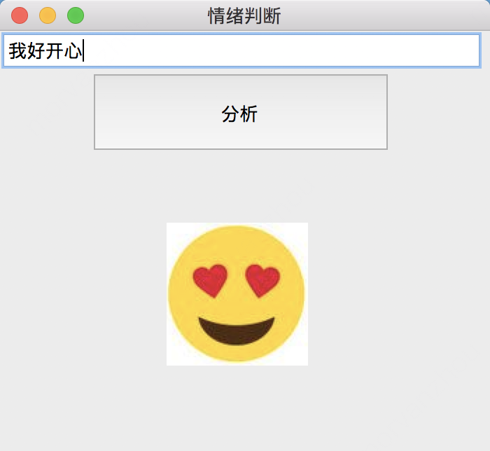
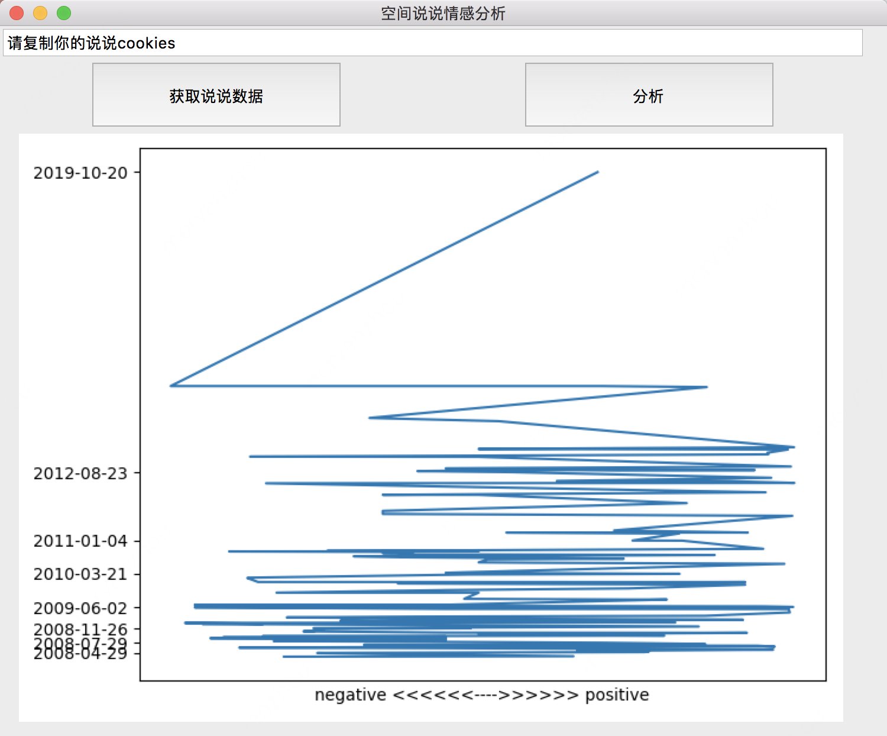

# AI 情感分析

课程以AI技术人员的角度，融入不同实践案例教授机器学习/深度学习/自然语言处理/情感分析等AI技术，
让学生在进行职业体验的同时能掌握基础的AI技术概念，并学会用AI能力解决身边的实际问题。

## 效果预览
小黄脸情感检测

QQ说说情感检测

## 学习材料

[文档材料](材料)

## 代码

- [ai_test.py](ai_test.py)
- [utils.py](utils.py) (支撑代码，不要求编写与理解)
- [ai.py](ai.py)
- [tk_test.py](tk_test.py) (Python小程序演示)
- [ai_face.py](ai_face.py) (小黄脸情感分析)
- [ai_shuoshuo.py](ai_shoushou.py) (QQ说收情感分析)

爬虫依赖：
- [shuoshuo](shuoshuo) macOS
- [shuoshuo.exe](shuoshuo.exe) Windows
